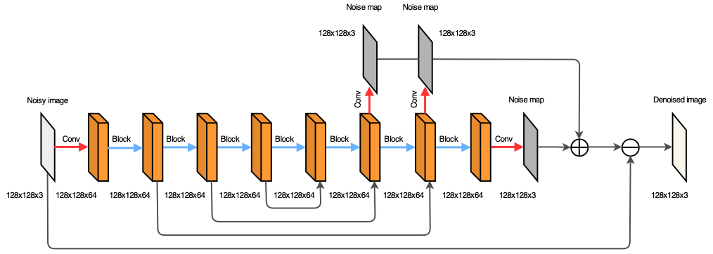
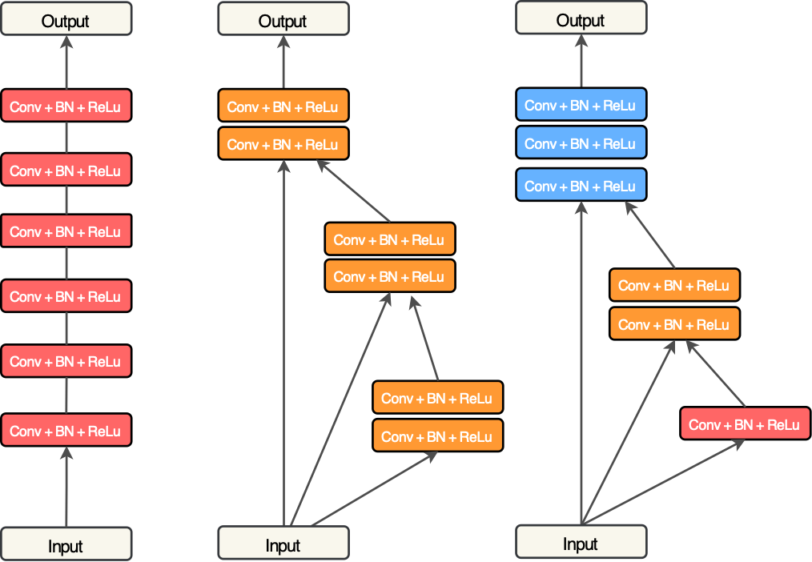
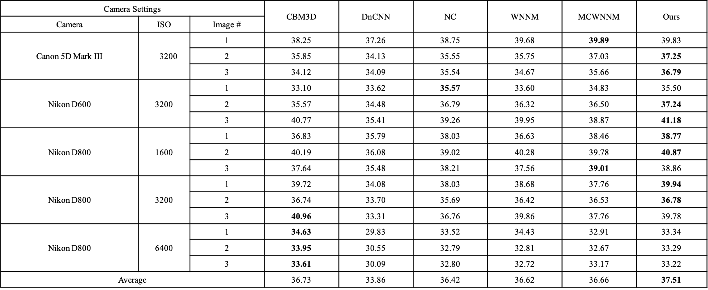
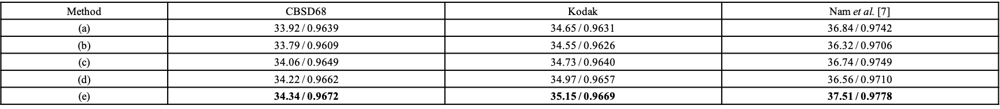

# SDNet

## A Simple and Robust Deep Convolutional Approach to Blind Image Denoising

by [Hengyuan Zhao](https://github.com/zhaohengyuan1/), [Wenze Shao](https://scholar.google.com.hk/citations?hl=zh-CN&user=0iHboRcAAAAJ), [Bingkun Bao](https://scholar.google.com.sg/citations?user=lDppvmoAAAAJ&hl=zh-CN), [Haibo Li](https://scholar.google.com/citations?user=MGZuzNEAAAAJ&hl=en)

## Dependencies

```
Python 3 (Recommend to use Anaconda)

Pytorch >=1.0.0

skimage

h5py

opencv-python

```
## Code

### Datasets

BSD400 was used in paper.

### Training 

The training file in the train documents.

1. clone this github repo.

```
git clone https://github.com/zhaohengyuan1/SDNet.git

cd SDNet
```

2. Generate your training data.(Recommend *.h5 file)

3. Run training file.

```
python ./train/SDN_Color_Blocks3.py
```

### Testing

Our testing codes are wrote in jupyter notebook.

## Network Architecture



Figure 1. Illustration of our SDNet for stagewise blind denoising of real photographs.

The total framework has three noise maps as the part of the total noise map and the Block in picture has three strutures in the following picture.



Figure 2. Three distinct building blocks. The left is the plain convolutional block, the middle and right present our lifted residual blocks for the proposed SDNet.

## Results



Table 1. Performance comparison of different blind denoising methods on the real image dataset of Nam et al. [1], including CBM3D [2], DnCNN [3], NC [4], WNNM [5], MCWNNM [6], and our SDNet. The bold indicates the best.




Table 2. Quantitative analysis (average PSNR and SSIM) of the SDNet on two synthetic datasets, i.e., CBSD68 [7] and Kodak, and a real noisy dataset [1]. (a) SDNet only keeping the final noise map, (b) SDNet without utilizing the shortcut connections, (c) SDNet with Block-1 in Figure 2, (d) SDNet with Block-2 in Figure 2, (e) SDNet with Block-3 in Figure 2, i.e., our final blind denoiser. The bold indicates the best.

# Acknowledgement

The study is supported in part by the Natural Science Foundation (NSF) of China (61771250, 61602257, 61572503, 61872424, 61972213, 6193000388), and the NSF of Jiangsu Province (BK20160904).